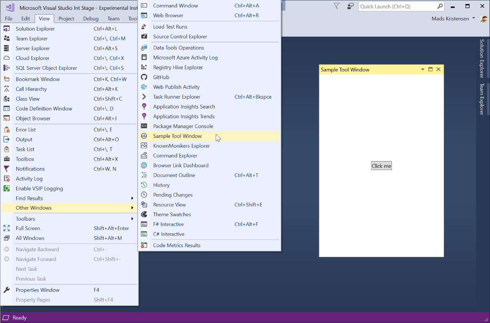

# Async Tool Window example

[](https://ci.appveyor.com/project/madskristensen/asynctoolwindowsample)

**Applies to Visual Studio 2017.6 and newer**

This sample shows how to provide an Async Tool Window in a Visual Studio extension.

Clone the repo to test out the sample in Visual Studio 2017 yourself.

## Specify minimum supported version
Since protocol handler support is new in Visual Studio 2017 Update 6, we need to specify that our extension requires that version or newer. We do that in the .vsixmanifest file like so:

```xml
<InstallationTarget Id="Microsoft.VisualStudio.Community" Version="[15.0.27413, 16.0)" />
```

*15.0.27413* is the full version string of Visual Studio 2017 Update 6.

See the full sample [.vsixmanifest file](src/source.extension.vsixmanifest).

## This sample
The code in this sample contains the concepts:

1. [Custom Tool Window Pane](src/ToolWindows/SampleToolWindow.cs)
2. [XAML control](src/ToolWindows/SampleToolWindowControl.xaml) for the pane
3. [Custom command](src/Commands/ShowToolWindow.cs) that can show the tool window
4. [AsyncPackage class](src/MyPackage.cs) that glues it all together

Follow the links above directly into the source code to see how it is all hooked up.



## Further reading
Read the docs for all the details surrounding these scenarios.

* [VSCT Schema Reference](https://docs.microsoft.com/en-us/visualstudio/extensibility/vsct-xml-schema-reference)
* [Use AsyncPackage with background load](https://docs.microsoft.com/en-us/visualstudio/extensibility/how-to-use-asyncpackage-to-load-vspackages-in-the-background)
* [Custom command sample](https://github.com/madskristensen/CustomCommandSample)